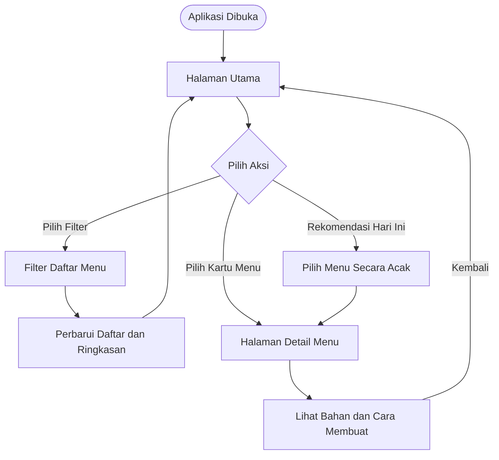
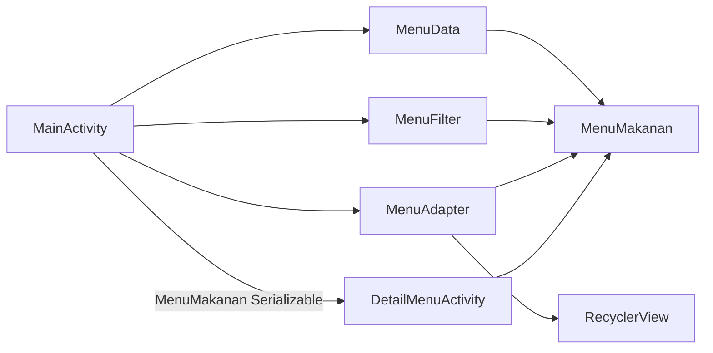

<div align="center">

# Kost Meal

**Aplikasi Android untuk menemukan rekomendasi menu yang hemat, praktis, dan relevan bagi anak kos.**


</div>

## Tentang Aplikasi

**Kost Meal** adalah aplikasi Android berbasis Kotlin yang membantu pengguna memilih menu makanan sederhana berdasarkan kebutuhan anak kos. Aplikasi menyediakan daftar menu beserta estimasi harga, kategori waktu makan, label menu, tingkat kesulitan, bahan-bahan, dan langkah pembuatan.

Seluruh data menu disimpan secara lokal di dalam project sehingga aplikasi dapat digunakan tanpa koneksi internet, database, maupun API eksternal.

## Fitur Utama

- Menampilkan **10 menu makanan** dalam daftar berbasis `RecyclerView`.
- Menyaring menu melalui kategori **Semua**, **Hemat**, **Praktis**, dan **Sehat**.
- Menampilkan ringkasan jumlah menu aktif dan jumlah menu hemat.
- Memilih satu menu secara acak melalui tombol **Rekomendasi Hari Ini**.
- Membuka halaman detail saat pengguna memilih kartu menu.
- Menampilkan nama, deskripsi, harga, kategori, label, tingkat kesulitan, bahan, dan cara membuat.
- Mempertahankan filter aktif ketika konfigurasi layar berubah, seperti saat rotasi perangkat.
- Menggunakan warna badge yang berbeda untuk label menu dan tingkat kesulitan.

## Aturan Filter

| Filter | Aturan |
|---|---|
| **Semua** | Menampilkan seluruh data menu. |
| **Hemat** | Menampilkan menu dengan harga maksimal **Rp10.000**. |
| **Praktis** | Menampilkan menu dengan label **Praktis**. |
| **Sehat** | Menampilkan menu dengan label **Sehat**. |

Tombol **Rekomendasi Hari Ini** memilih satu menu secara acak dari seluruh data menu, kemudian membuka halaman detail menu tersebut.

## Alur Pengguna



## Teknologi yang Digunakan

| Komponen | Implementasi |
|---|---|
| Bahasa | Kotlin 2.1.0 |
| Antarmuka | XML Layout dan Material Components |
| Minimum Android | Android 6.0 / API 23 |
| Compile dan Target SDK | API 35 |
| Build System | Gradle 8.9 dan Android Gradle Plugin 8.7.3 |
| Binding | View Binding |
| Daftar Menu | RecyclerView, ListAdapter, dan DiffUtil |
| Pengujian | JUnit 4 |
| Sumber Data | Data statis lokal melalui `MenuData` |

## Struktur Project

```text
KostMeal/
├── app/
│   ├── src/
│   │   ├── main/
│   │   │   ├── java/com/example/kostmeal/
│   │   │   │   ├── MainActivity.kt
│   │   │   │   ├── DetailMenuActivity.kt
│   │   │   │   ├── adapter/
│   │   │   │   │   └── MenuAdapter.kt
│   │   │   │   ├── data/
│   │   │   │   │   └── MenuData.kt
│   │   │   │   ├── filter/
│   │   │   │   │   └── MenuFilter.kt
│   │   │   │   └── model/
│   │   │   │       └── MenuMakanan.kt
│   │   │   ├── res/
│   │   │   │   ├── drawable/
│   │   │   │   ├── layout/
│   │   │   │   │   ├── activity_main.xml
│   │   │   │   │   ├── activity_detail_menu.xml
│   │   │   │   │   └── item_menu.xml
│   │   │   │   └── values/
│   │   │   │       ├── colors.xml
│   │   │   │       ├── strings.xml
│   │   │   │       └── themes.xml
│   │   │   └── AndroidManifest.xml
│   │   └── test/
│   │       └── java/com/example/kostmeal/
│   └── build.gradle.kts
├── gradle/
│   └── libs.versions.toml
├── build.gradle.kts
└── settings.gradle.kts
```

## Pembagian Tanggung Jawab Komponen

| Komponen | Tanggung Jawab |
|---|---|
| `MainActivity` | Mengatur halaman utama, filter, ringkasan menu, rekomendasi acak, dan navigasi. |
| `DetailMenuActivity` | Menerima objek menu dan menampilkan seluruh detail menu. |
| `MenuAdapter` | Menghubungkan data menu dengan kartu pada `RecyclerView`. |
| `MenuData` | Menyediakan 10 data menu statis. |
| `MenuFilter` | Menangani logika filter dan perhitungan menu hemat. |
| `MenuMakanan` | Menyimpan struktur data dan fungsi pendukung, seperti format harga dan daftar bahan. |



## Menjalankan Project

### Prasyarat

- Android Studio versi terbaru yang kompatibel dengan AGP 8.7.3.
- JDK 11 atau konfigurasi JDK bawaan Android Studio yang kompatibel.
- Android SDK API 35.
- Emulator atau perangkat Android dengan minimal API 23.
- Koneksi internet saat Gradle Sync pertama kali dilakukan.

### Langkah Instalasi

1. Clone repository:

   ```bash
   git clone <URL-REPOSITORY-ANDA>
   ```

2. Buka folder project melalui Android Studio.
3. Tunggu proses **Gradle Sync** hingga selesai.
4. Pilih emulator atau perangkat Android yang sudah mengaktifkan USB debugging.
5. Tekan tombol **Run** atau gunakan perintah berikut:

   **Windows**

   ```bash
   gradlew.bat installDebug
   ```

   **Linux/macOS**

   ```bash
   ./gradlew installDebug
   ```

## Build APK

Untuk membuat APK debug:

**Windows**

```bash
gradlew.bat assembleDebug
```

**Linux/macOS**

```bash
./gradlew assembleDebug
```

APK akan tersedia pada:

```text
app/build/outputs/apk/debug/app-debug.apk
```

## Pengujian

Project memiliki unit test untuk memverifikasi:

- Format harga dalam format Rupiah Indonesia.
- Penentuan menu hemat berdasarkan batas harga Rp10.000.
- Konversi daftar bahan menjadi teks berpoin.
- Hasil filter Hemat, Praktis, dan Sehat.
- Konsistensi jumlah data utama dan hasil filter.

Jalankan pengujian dengan:

**Windows**

```bash
gradlew.bat test
```

**Linux/macOS**

```bash
./gradlew test
```

## Keputusan Teknis

- **View Binding** digunakan agar akses komponen UI lebih aman dan tidak bergantung pada `findViewById`.
- **ListAdapter dan DiffUtil** digunakan untuk memperbarui daftar dengan lebih terstruktur.
- **Serializable** digunakan untuk mengirim satu objek `MenuMakanan` dari halaman utama ke halaman detail.
- Logika filter dipisahkan dari activity agar lebih mudah dibaca dan diuji.
- Teks antarmuka disimpan pada `strings.xml` untuk memudahkan pemeliharaan dan pengembangan lokalisasi.
- Data dibuat statis agar ruang lingkup project tetap sederhana dan dapat berjalan sepenuhnya secara offline.

## Batasan Versi Saat Ini

- Data belum menggunakan Room, SQLite, Firebase, atau layanan API.
- Pengguna belum dapat menambah, mengubah, atau menghapus menu.
- Belum tersedia fitur pencarian dan menu favorit.
- Seluruh menu masih menggunakan ikon makanan generik yang sama.
- Rekomendasi menu masih menggunakan pemilihan acak tanpa personalisasi.

## Rencana Pengembangan

- Menambahkan gambar berbeda untuk setiap menu.
- Menambahkan pencarian berdasarkan nama atau bahan.
- Menambahkan fitur favorit dan riwayat menu.
- Menyimpan data melalui Room Database.
- Menambahkan filter berdasarkan anggaran, waktu makan, dan tingkat kesulitan.
- Menambahkan rekomendasi berdasarkan preferensi pengguna.
- Menambahkan dukungan tema gelap dan peningkatan aksesibilitas.

## Kontribusi

Kontribusi dapat dilakukan melalui alur berikut:

1. Fork repository.
2. Buat branch fitur baru.
3. Lakukan perubahan dan pengujian.
4. Commit dengan pesan yang jelas.
5. Kirim pull request disertai deskripsi perubahan.

Contoh:

```bash
git checkout -b feature/pencarian-menu
git commit -m "feat: menambahkan pencarian menu"
git push origin feature/pencarian-menu
```

---

<div align="center">

Dikembangkan sebagai project pembelajaran Android menggunakan **Kotlin dan XML**.

</div>